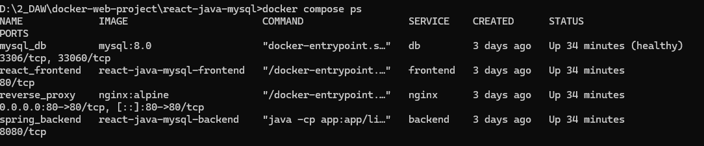
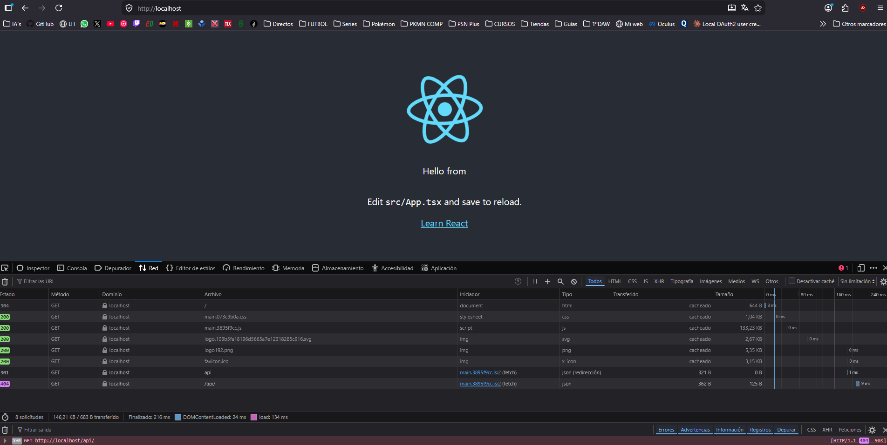
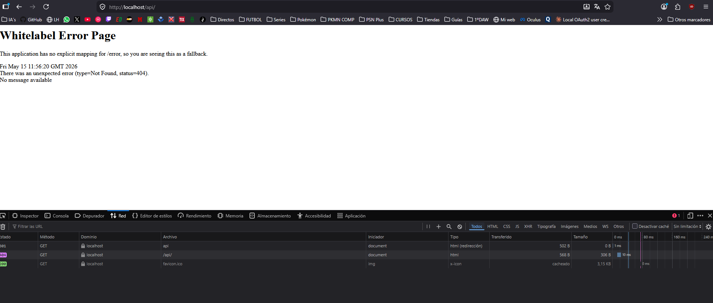
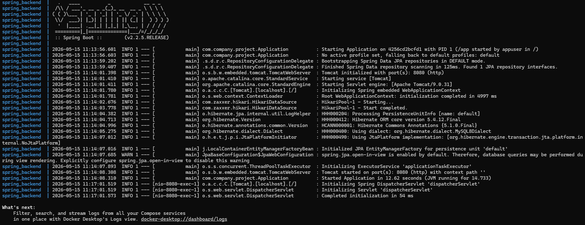
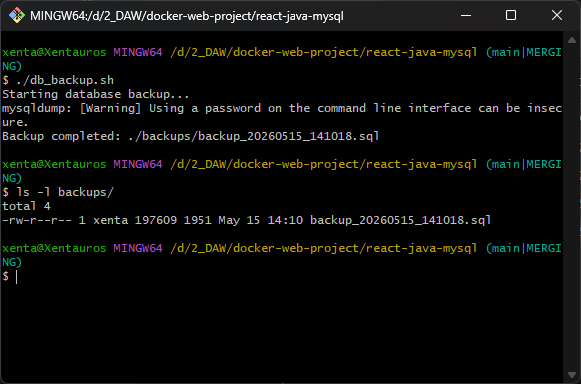
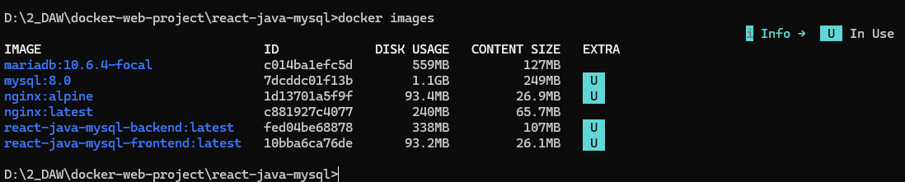

# Technical Documentation — Docker Project (RA3 Recovery)
**Student:** Vicente Peinado | **Module:** Web Application Deployment (2º DAW) | **GitHub:** https://github.com/Xentauross/docker-web-project.git

---

## Part A — Deployment Manual

### 1. Project Architecture
The project is structured into three main components (Frontend, Backend, and Database) orchestrated using **Docker Compose**. All external traffic is managed by an **Nginx** web server acting as a reverse proxy.

* **Nginx (Proxy):** The single entry point. Only port 80 is exposed to the outside. It routes traffic to the React frontend or the Spring Boot backend based on the URL path.
* **Frontend (React):** Serves the user interface. It runs on a lightweight Nginx instance.
* **Backend (Spring Boot):** The Java API. It is the only component with direct access to the database.
* **Database (MySQL):** Stores data using a persistent volume to ensure data remains intact if the container is stopped or removed.

### 2. Deployment Steps
To deploy this environment on any machine with Docker and Git installed, follow these steps:

1.  **Clone the repository:**
    ```bash
    git clone <YOUR_REPO_URL>
    ```
2.  **Navigate to the project folder:**
    ```bash
    cd react-java-mysql
    ```
3.  **Configure environment variables:**
    Copy the example file and fill in the required passwords and configuration.
    ```bash
    cp .env.example .env
    ```
4.  **Launch the containers:**
    ```bash
    docker compose up --build -d
    ```

Once the process completes, the application will be accessible at `http://localhost`.

### 3. Networks and Configuration
* **Networks:** I have implemented two isolated networks: `react-spring` and `spring-mysql`. This ensures the frontend is completely isolated and cannot communicate directly with the database, enhancing security.
* **Configuration:** The entire orchestration is managed via `compose.yaml`. Proxy routing rules are defined in `nginx/nginx.conf`.

### 4. Multi-Stage Builds (Optimization & Security)
I utilize multi-stage builds to ensure container images are optimized for production.

* **Frontend:** The Node image is used only during the build phase to compile the React code. The resulting static files are then moved to a clean Nginx image. This avoids installing Node.js in the production environment, reducing the image size from ~1GB to approximately 25MB.
* **Backend:** Maven is used only to compile the `.jar` file. This artifact is then transferred to an image containing only the Java Runtime Environment (JRE).
* **Security Benefit:** By removing the source code and build tools (like Maven or npm) from the final image, the attack surface is significantly reduced.

### 5. Healthchecks in MySQL
MySQL requires time to initialize its internal processes. If Docker starts the Backend simultaneously, the Backend will fail to connect and crash.
By implementing a **healthcheck** in the database service and using `depends_on: condition: service_healthy` in the backend configuration, the API waits until MySQL is fully operational before attempting to start.

---

## Part B — Administration Manual

### 6. Basic Maintenance Commands
To manage the project lifecycle, the following commands are used:

* **Check service status:** `docker compose ps`
* **View real-time logs:** `docker compose logs -f`
* **Stop services (preserving data):** `docker compose down`
* **Remove everything (including volumes/data):** `docker compose down -v`

### 7. Security Measures
The following security configurations have been applied:

* **Port Isolation:** Only Nginx port 80 is exposed. MySQL and the Java API (port 8080) are hidden within the internal Docker network.
* **Secrets Management:** No passwords are hardcoded. All sensitive data is managed via the `.env` file, which is excluded from version control via `.gitignore`.
* **Resource Limits:** Memory limits (512M) have been set for the backend and database in `compose.yaml` to prevent a single service from exhausting host resources.
* **Non-Root User:** The Java Dockerfile uses a dedicated `appuser` to ensure the application does not run with root privileges.

### 8. Testing and Backups
* **Backup Script:** I have developed `db_backup.sh`. When executed, it runs `mysqldump` inside the MySQL container and saves a timestamped `.sql` file to the host machine.
* **Functionality Verification:**
    * Verified that `http://localhost` loads the React frontend correctly.
    * Confirmed the API responds via `http://localhost/api/`.
    * Checked logs (`docker compose logs backend`) to ensure the connection to MySQL is established successfully on the first attempt thanks to the healthcheck.

### 9. Screenshot

## Capture 1: Running Containers and MySQL Healthcheck Validation


## Capture 2: React Frontend Accessed via Nginx Reverse Proxy


## Capture 3: Spring Boot API Response via Nginx Routing


## Capture 4: Backend Logs Showing Successful Database Connection


## Capture 5: Automated Database Backup Script Execution


## Capture 6: Optimized Image Sizes using Multi-Stage Builds
